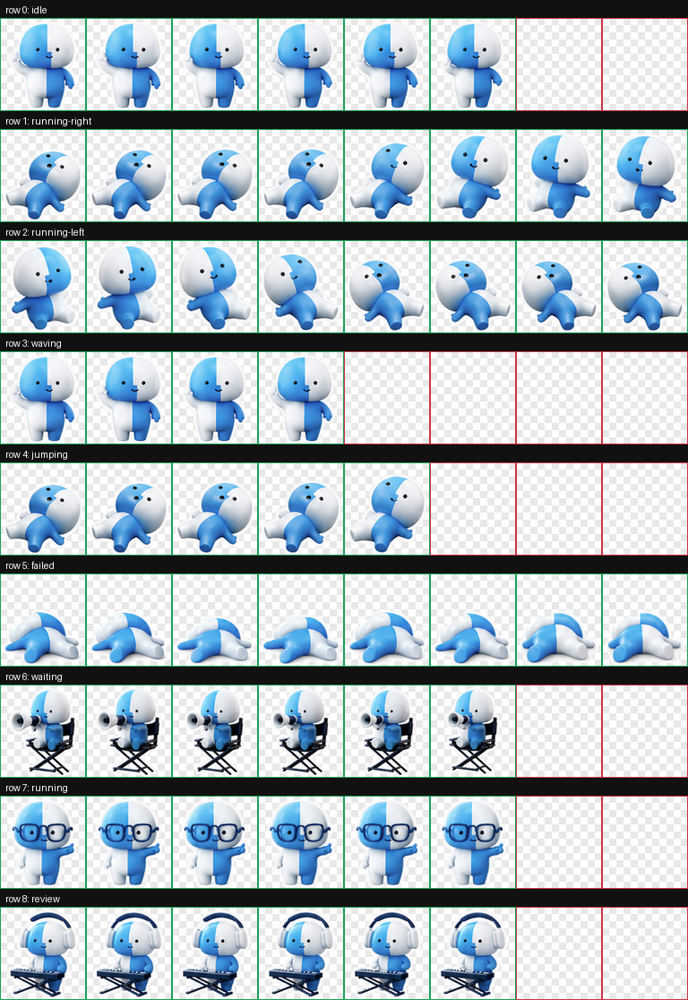

# Lil Finder Guy Codex Pet

An unofficial custom Codex pet: a soft, Finder-inspired little desktop buddy.



## Install

Clone this repository into your Codex pets folder:

```sh
mkdir -p ~/.codex/pets
git clone https://github.com/f0rmwk/lil-finder-guy-codex-pet.git ~/.codex/pets/lil-finder-guy
```

Then open Codex, go to the pet picker, and select **Refresh**. The pet appears as **Lil Finder Guy**.

## Files

- `pet.json` - Codex custom pet manifest.
- `spritesheet.png` - transparent RGBA Codex pet atlas.
- `spritesheet.webp` - lossless WebP copy of the same atlas.
- `preview/contact-sheet.png` - preview image for reviewing the animation rows.

## Atlas

The sprite sheet follows the Codex custom pet atlas layout:

- `1536x1872`
- `8` columns by `9` rows
- `192x208` per cell
- transparent unused cells

## License

MIT. This is unofficial fan art and is not affiliated with Apple.
